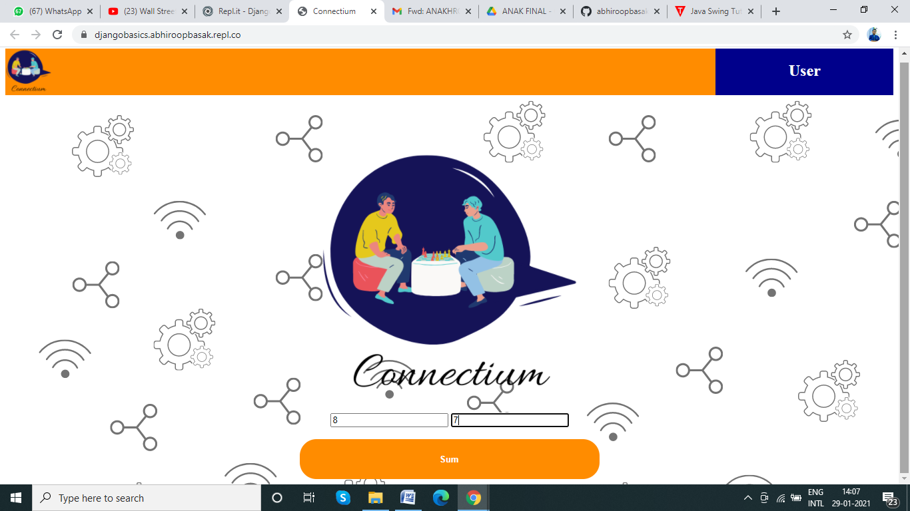
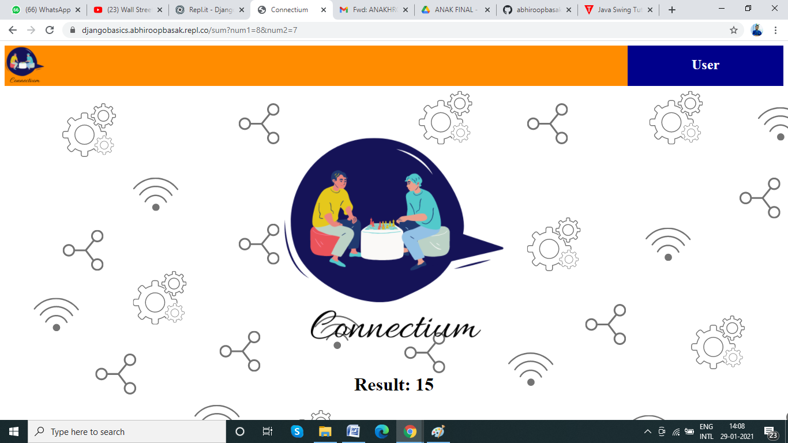

# Learning With Django

## Django: a python framework

Django framework is used to create dynamic websites. A project was created with the following website and the simple action performed was demonstration of addition and using class and function in python implememt django tools. Use of Jinja language was used to edit the html code. 

The home page looks as follows

Upon clicking "Sum" a function sum is called in the python language and the result is given out in the same webpage with a particular segment changed. This also calls for the base.html file which consists of the basic design of the home. The pages home.html and result.html are respective I/O requirements.

Furthermore, the use of repl.it was used to develop the same. The exact repository can be seen by visiting [here](https://repl.it/@abhiroopbasak/DjangoBasics)
Visit the webpage hosted in repl.it at [here](https://djangobasics.abhiroopbasak.repl.co/)

